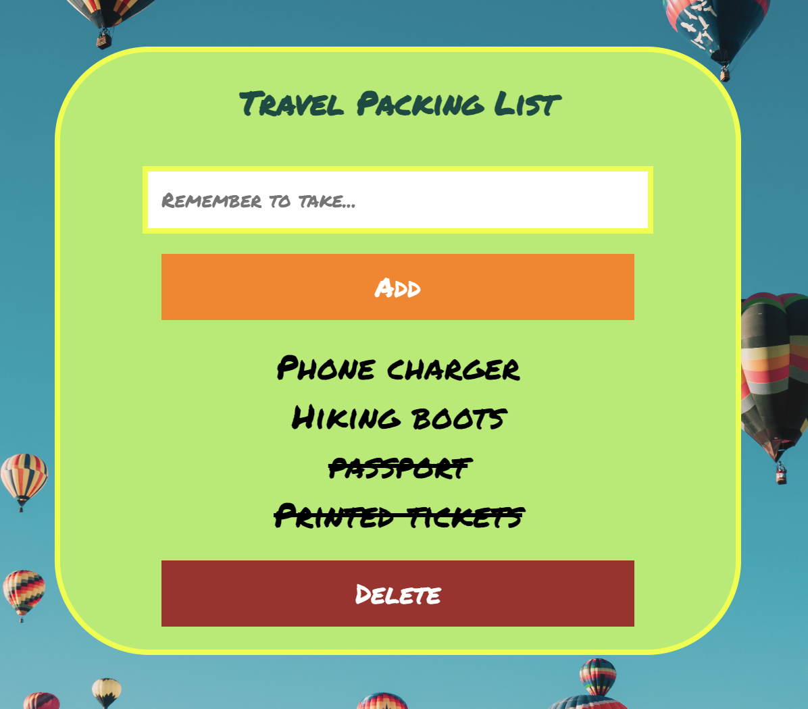

<h1 align="center"><a href="https://travel-checklist-app.netlify.app/"><strong>Travel Checklist App</strong></a></h1>
<p align="center">
  
</p>

## About
A basic check-list to help you pack the essentials (and other things!) for your upcoming trip. Allows you to add, check and delete list items. 

## Technologies used:


## How to use 
To clone and run this application, you'll need [Git](https://git-scm.com) and [Node.js](https://nodejs.org/en/download/) (which comes with [npm](http://npmjs.com)) installed on your computer. From your command line:

```bash
# Clone this repository
$ git clone https://github.com/lucid-dreamer11/travel-checklist

# Go into the repository
$ cd travel-checklist

# Install dependencies
$ npm install

# Run the app
$ npm start
$ Visit http://localhost:3000 in your browser to see the application running.
```
## Limitations
Currently the project requires additional work to be done to scale it for mobile devices.

## Acknowledgements 
Thanking Alla's CanSheCode programming school for the inspiration with this study project. 